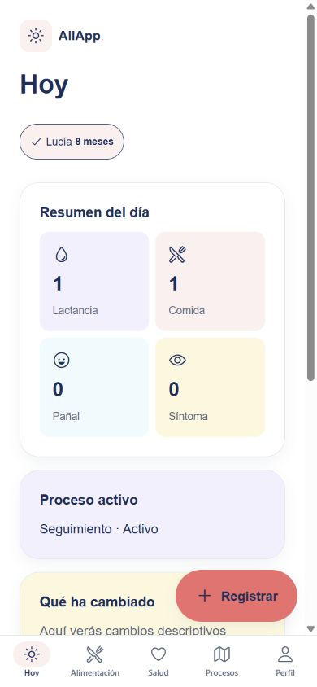
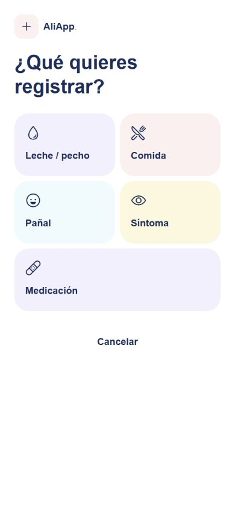
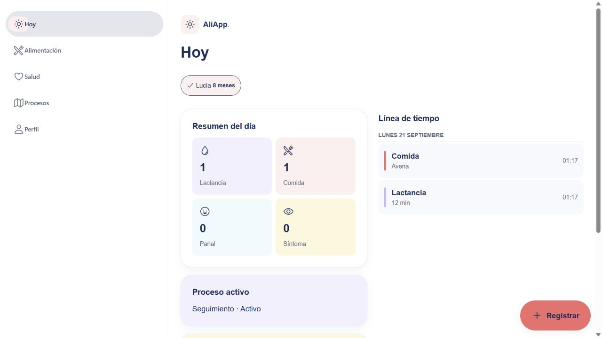

# Branding AliApp — verificación

## Alcance

Identidad aprobada: blanco, coral #FF6B6B, navy #0F2D5B, aqua #22D3EE, sunshine #FFC93C y lavender #C4B5FD. Se conservan Expo / React Native, las cinco pestañas, rutas, validaciones, servicios, permisos, migraciones y modelos. Sin nuevas dependencias.

- Tokens con texto navy, secundarios con mayor contraste, radios de 24/32, espaciado 24 y tipografía nativa adaptable al sistema.
- Botones con texto navy sobre coral, carga y foco; campos con etiqueta persistente y error; chips seleccionados con marca además de color.
- Cabeceras, tarjetas, vacíos y estados de consulta coherentes en Hoy, Alimentación, Salud, Procesos y Perfil.
- Registro rápido con iconos y colores; selector compacto al abrir formulario; textos visibles localizados sin modificar valores persistidos.
- Zonas seguras, teclado iOS, tabs que se ocultan al abrir teclado y espacio final para el botón flotante.

## Evidencia

- npm run typecheck: correcto.
- npm run lint: correcto.
- Jest: 8 suites de dominio, 55 pruebas correctas; 3 suites de integración/RLS, 22 pruebas correctas (77 en total).
- expo export --platform ios --platform android --output-dir dist/native --max-workers 2: correcto para ambas plataformas. Esto verifica bundles JS/Hermes; no es una compilación firmada ni ejecución nativa.
- Navegador integrado: revisión a 390×844 y 360×800. Acceso, validación, cinco pestañas, panel de alimentos, registro rápido, selección, Guardar habilitado/deshabilitado, regreso a Hoy y desplazamiento hasta el final. Datos ficticios de servidor local fuera del repositorio, sin credenciales reales.
- Capturas y galería: ../outputs/aliapp-review/revision-visual.html desde el directorio padre del repo.

## Pendientes y límites

- Sin simulador iOS ni Android SDK/adb en este equipo. Pendiente ejecución real en iOS y Android: teclado, VoiceOver/TalkBack, tamaños de letra grandes, zonas seguras y gesto atrás. No se instalaron herramientas de sistema.
- Postgres 16.15 portable ejecutado sin instalación de sistema ni permisos de administrador, limitado a 127.0.0.1:55432. Se aplicaron las 14 migraciones, seed y shim de Supabase del repositorio. Pasaron las 22 pruebas existentes, incluido el corte vertical. El shim no incluye Storage: la migración 0012 omite sus buckets/políticas; esto no verifica Supabase Auth/Storage reales.
- Las capturas web no certifican equivalencia visual en los dos sistemas móviles.
- Falta probar guardado y sesión contra el backend real. Los fixtures solo permiten revisar UI; no validan persistencia ni autorización.
- Integrado sobre df8fbf6, conservando navegación lateral, distribución adaptable y etiquetas traducidas del cambio previo. Propuesta en rama codex/aliapp-branding; no fusionada.

## Capturas de la versión integrada

Datos ficticios; React Native Web, no dispositivos nativos. Consola sin errores durante la revisión final.

